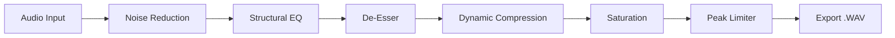

# 🎧 AudioOptimizer Pro: Enterprise DSP Pipeline


## 🚀 Il Tuo Studio di Mastering in Riga di Comando

**AudioOptimizer Pro** è un framework enterprise progettato per l'ottimizzazione massiva di asset sonori. Sviluppato per podcasting, game design e dataset per il Machine Learning, questo tool automatizza la complessa catena di segnale (DSP) necessaria per trasformare registrazioni grezze in prodotti audio professionali e cristallini.

Dimentica l'editing manuale traccia per traccia. Grazie a un'architettura asincrona e algoritmi avanzati basati su `SciPy` e `noisereduce`, la pipeline applica una catena di mastering completa: dalla riduzione del rumore ambientale alla compressione dinamica, fino al limiting finale. Tutto questo con una CLI moderna che garantisce il controllo totale su ogni fase del processo.

---

## 📌 Indice
* [✨ Caratteristiche Principali](#-caratteristiche-principali)
* [🏗️ Architettura DSP](#-architettura-dsp)
* [📂 Struttura della Repository](#-struttura-della-repository)
* [⚙️ Installazione](#-installazione)
* [🛠️ Guida all'Uso](#-guida-alluso)
* [🖼️ Media](#-media)
* [🗺️ Roadmap](#-roadmap)
* [❓ FAQ](#-faq)
* [🤝 Contribuire](#-contribuire)

---

## ✨ Caratteristiche Principali
* **🧹 Noise Reduction Algoritmica**: Rimozione intelligente dei disturbi di fondo preservando le armoniche vocali.
* **🎚️ Equalizzazione Strutturale**: Filtro passa-alto (HPF) per eliminare rimbombi e attenuazione della banda "boxiness" (200-400Hz).
* **🗣️ Presenza & De-Esser**: Boost intelligente delle frequenze medie per l'intelligibilità e attenuazione mirata delle sibilanti (5-8kHz).
* **📉 Compressione Dinamica**: Normalizzazione dei picchi e riduzione del range dinamico per un suono compatto e professionale.
* **⚡ Saturazione & Limiter**: Saturazione armonica leggera via `tanh` e limiter di sicurezza per evitare il clipping digitale.

---

## 🏗️ Architettura DSP



---

## 📂 Struttura della Repository
```text
.
├── main.py              # Orchestrazione della pipeline e CLI
├── custom_logger.py     # Gestione log aziendali e diagnostica
├── requirements.txt     # Dipendenze (Pydub, Noisereduce, Scipy, Rich)
└── README.md            # Documentazione tecnica
```

---

## ⚙️ Installazione

1. **Clona la repository**:
   ```bash
   git clone https://github.com/mattemn97/audio-optimizer-pro.git
   cd audio-optimizer-pro
   ```

2. **Requisito di Sistema**: Assicurati di avere **FFmpeg** installato sul tuo sistema (necessario per `pydub`).
   ```bash
   # macOS
   brew install ffmpeg
   # Ubuntu/Debian
   sudo apt install ffmpeg
   ```

3. **Installa le dipendenze Python**:
   ```bash
   pip install -r requirements.txt
   ```

---

## 🛠️ Guida all'Uso

Avvia l'interfaccia interattiva e segui i prompt a video:

```bash
python main.py
```

### Configurazione Moduli:
Durante l'esecuzione, potrai attivare o disattivare i seguenti moduli tramite prompt:
* **Noise Reduction**: Ideale per registrazioni casalinghe.
* **Equalizzazione**: Pulisce le risonanze della stanza.
* **Limiter**: Fondamentale se intendi pubblicare il file su piattaforme streaming.

> [!IMPORTANT]
> Il sistema esporta automaticamente in formato **WAV** per preservare la massima fedeltà audio dopo il processamento.

---

## 🖼️ Media

| Stadio | Visualizzazione Spettrale |
| :--- | :--- |
| **Grezzo** |  |
| **Ottimizzato** |  |

---

## 🗺️ Roadmap
- [ ] **Multiprocessing**: Implementazione di `concurrent.futures` per processare più file simultaneamente.
- [ ] **Preset Specialistici**: Aggiunta di modalità predefinite (es. "Vocal", "Music", "Podcast").
- [ ] **Supporto VST**: Interfacciamento con plugin esterni tramite `pedalboard`.
- [ ] **Analisi LUFS**: Implementazione della misurazione del volume percepito (Loudness).

---

## ❓ FAQ

**Q: Quali formati sono supportati in ingresso?** **A:** Supportiamo `.wav`, `.mp3`, `.flac`, `.ogg` e `.m4a`. Grazie a FFmpeg, la compatibilità è pressoché universale.

**Q: Il limiter distorce il suono?** **A:** No, il limiter è configurato per intervenire solo sui picchi che superano la soglia di sicurezza, garantendo un output a -0.5 dBFS senza clipping udibile.

---

## 🤝 Contribuire
Siamo entusiasti di ricevere pull request! Se vuoi implementare un nuovo filtro DSP o migliorare l'interfaccia, segui il workflow standard di GitHub e assicurati di documentare i cambiamenti nel file `custom_logger`.

---

## 📄 Licenza
Il progetto è rilasciato sotto licenza MIT.

---

## 🌟 Credits
* **pydub**: Manipolazione audio semplificata.
* **noisereduce**: Algoritmi di denoising allo stato dell'arte.
* **Rich**: Per la gestione della user experience nel terminale.

---

## 📨 Contatti
**Sviluppatore**: mattemn97  
**GitHub Profile**: [https://github.com/mattemn97](https://github.com/mattemn97)

`audio-processing` `dsp` `python` `automation` `mastering` `podcast-tools` `scipy` `pydub` `batch-processing` `noise-reduction` `equalization` `audio-engineering` `cli`
